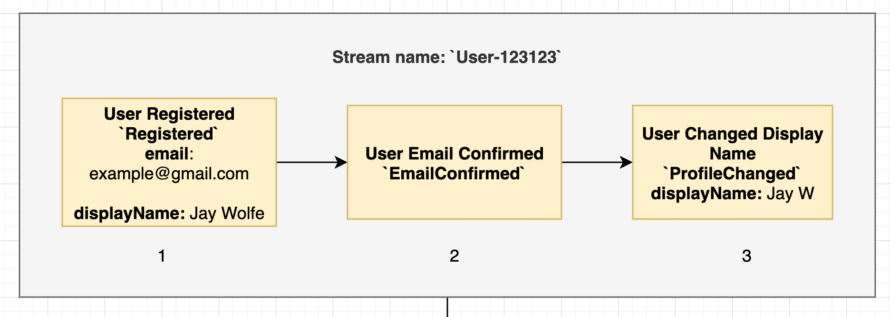
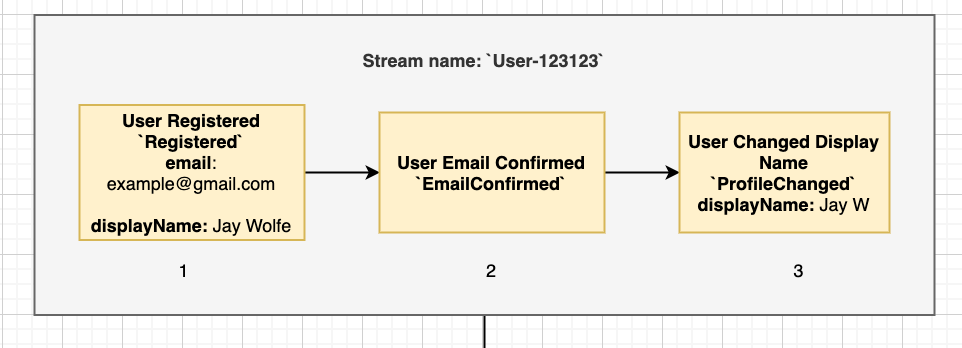
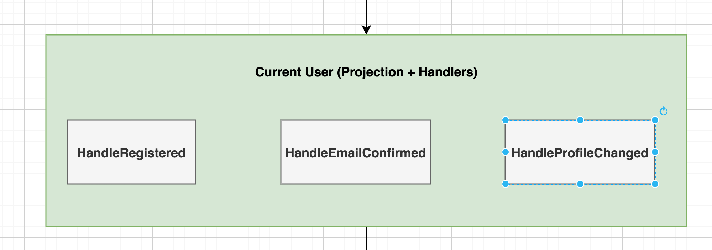
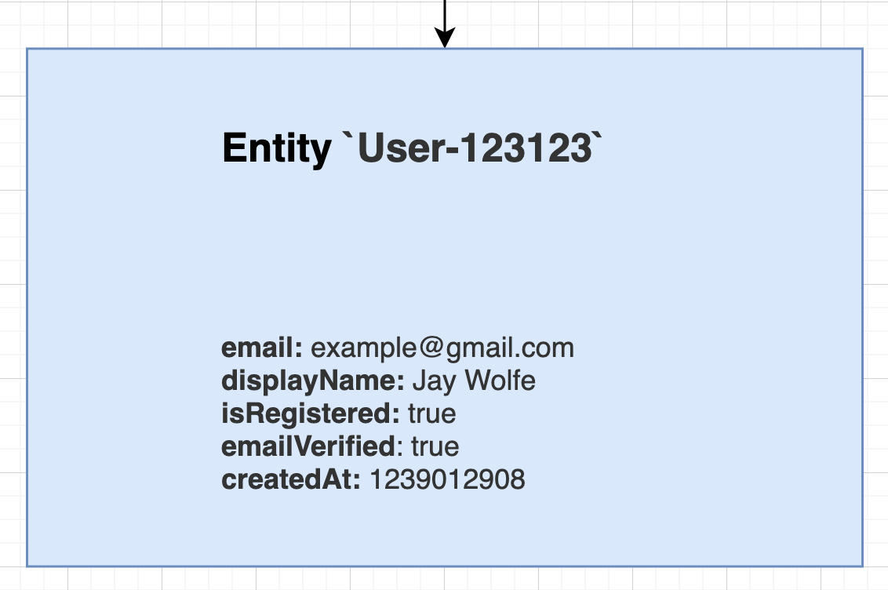
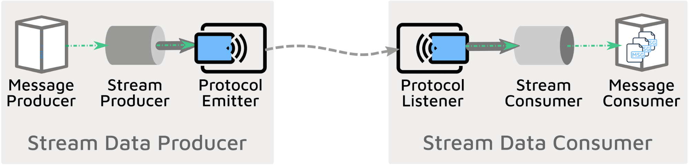
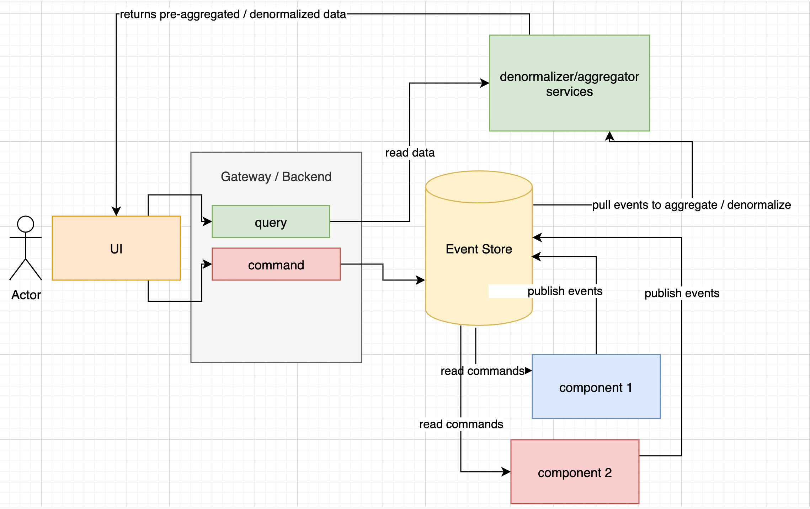

## The Joys Of Event Sourcing In NodeJS

---
### What You Might Learn Today

@ul[list-spaced-bullets  text-white-text-09]
- What is event sourcing?
- Pros/cons of event sourcing
- What is an event stream?
- What is an Entity in event sourcing?
- Exposure to sample events and an event sourced application + tooling to help you get started
@ulend

---
### So what is it?


@snap[text-pink text-08]
Event sourcing is a pattern that can help handle data in distributed systems in a scalable way - storing everything as events means everything regarding the domain logic is a first class citizen.

In other words, rather than CRUD, everything is an event!

Your components then "pay attention" to those events needed to aggregate data that's relevant to the use cases of what your building!

@snapend

---
### Keywords

- **events -** data + event type (think polymorphism) usually stored in order
- **streams -** collections of events
- **event store -** database - build your own or use a product or in this case open source
- **projections -** processes a stream into an aggregate entity - can be stored as a read model
- **read model -** might not be necessary - especially if aggregate streams are less than 100 events
---
### How do I do it?


@ol[text-yellow text-10]
- Have A plan

- Identify business domain - what problem are you solving

- Find the bounded contexts - ie - "Users", "Accounts", "Orders"

- Identify the most important ideas and model them with ubiquitous language

@olend

---
### Small Example:
@snap[text-yellow text-07]
User Registration == `INSERT INTO users (id, email, password_hash) VALUES...` + `INSERT INTO analytics` + `Write Analytics Related Events` + `Trigger Email Service` ? 
@snapend
@snap[text-red]
NO WAY!
@snapend
@snap[text-green]
User Registration == 
@ul
- `Publish Register Command` -> 
- `Consume Register Command` -> 
- `Publish User_Registered Event` -> 
- `All Relevant Components Self Update and Aggregate` (email service listens to User_Registered, profile consumer listens to User_Registered event, etc.)
@ulend
@snapend
---
#### A Visualization of... Events



---
#### A Visualization of... Projections
@snap[span-50]

@snapend
@snap[span-80]

@snapend
---
#### A Visualization of... Current User
@snap[span-20]

@snapend
@snap[span-40]

@snapend
@snap[span-50]

@snapend
---
## It's All About Streams
@snapend

@snap[north-east span-100]

@snapend

@snap[south span-100 text-06]
Everything is an event in the data stream - commands and queries
A stream means "linear" which means consistency is easy to manage
Avoids more of the race condition problems that can happen with queue consumers thanks to "optimistic currency control"
@snapend

---
### Event Sourced Architecture



---
@snap[text-yellow]
Sample Use Case - User Registration + URL Generator

Register Command
@snapend

```json
{
    "type": "Register",
    "data": {
        "email": "jay@gmail.com",
        "userId": "7a6ed945-320e-4fc9-b101-b6b2d350bf9b",
        "nickname": "Jay Wolfe",
        "passwordHash": "$argon2i$v=19$m=4096,t=3,p=1$rxCRJ2eA749c9jG8L8hc6w$nPgCNA60/MdWlRo/DriBWkyJSCaf+EhoVO762tnmCMk"
    },
    "metadata": {
        "userId": "7a6ed945-320e-4fc9-b101-b6b2d350bf9b",
        "traceId": "bddf931e-21e1-45fc-8c61-8aa210e670d9"
    },
    "time": "2020-10-08 02:43:27.888914"
}
```
---
@snap[text-yellow]
Example Register Command Subscriber (User Microservice / Component)
@snapend

@snap[span-100]
@code[javascript zoom-06](src/registerSub.js)
@snapend
---
### If You Go Down This Path - Remember these things!

- **start with a single server and scale out to multiple component deployments** 
- **model folder structure with your bounded contexts for easy separation**
- **streams are arguably easier to reason about than queues**
- **streams make it easy to handle concurrency issues**
- **use idempotent handlers**
- **event storm your system ahead of time - also don't conflate the word SYSTEM**
---
### It can't be all good right? (aka things not to do)

- **using a single database across services to share models**
- **single db for separate distributed services with only REST as the communication method**
- **event sourcing thought process is hard - especially the first time you do it**
- **don't write db updates against your message stream (ie keep them immutable) - reverse / undo / transform**
- **believe that queues can solve all your problems** (streams can be easier to reason about)
---
### Additional Pitfalls
- **UX can be forced to play along in certain situations because of task based intead of update based**
- **not getting bounded contexts right for the business domain causing heavy change / flux in event contracts causing loss of fidelity**
- **spaghetti contracts where "who's reading what from what stream" becomes unclear**
- **materialization / projection will become expensive snapshotting is a must**